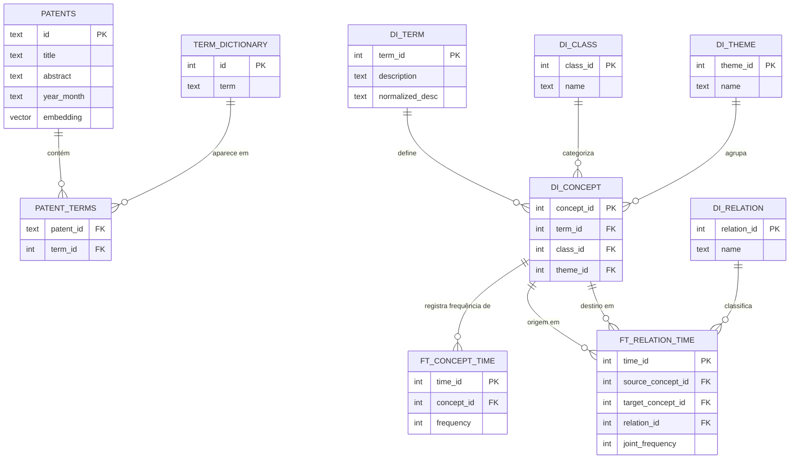

# Guia de Arquitetura de Dados e Integração Cliente

Este documento descreve a modelagem do banco de dados da API do **Patent AI Lab**, o mapeamento de tabelas para endpoints e as melhores práticas para integração e análise de dados no lado do cliente (ex: Dash, Jupyter Notebooks) utilizando **Pandas**.

---

## 1. Arquitetura do Banco de Dados

O banco de dados do projeto está dividido em duas partes lógicas principais:
1. **Core Patent Data**: Tabelas operacionais cruciais para busca semântica e indexação direta de patentes e seus termos.
2. **Catalog Dimensions & Facts (Esquema Estrela/Snowflake)**: Tabelas com o prefixo `di_` (dimensões) e `ft_` (fatos), otimizadas para consultas analíticas estruturadas e análises temporais de conceitos.

### Diagrama de Entidade-Relacionamento (ERD)



---

## 2. Dicionário de Dados (Tabelas)

### 2.1. Core Patent Tables

*   **`patents`**: Registra as patentes e seus vetores de embedding.
    *   `id` (text, PK): Identificador único da patente (ex: `US-11520110-B2`).
    *   `title` (text): Título do documento.
    *   `abstract` (text): Resumo da patente.
    *   `year_month` (text): Período de publicação no formato `YYYY-MM`.
    *   `embedding` (vector/text): Embeddings semânticos para cálculo de similaridade de cosseno.
*   **`term_dictionary`**: Índice geral de termos tecnológicos mapeados.
    *   `id` (int, PK): ID sequencial do termo.
    *   `term` (text): A string do termo (ex: `"deep learning"`).
*   **`patent_terms`**: Tabela associativa (muitos-para-muitos) relacionando patentes aos termos extraídos.
    *   `patent_id` (text, FK): Referência a `patents.id`.
    *   `term_id` (int, FK): Referência a `term_dictionary.id`.

### 2.2. Dimensional Catalog (`di_` & `ft_`)

*   **`di_term`**: Tabela de dimensão de termos estruturados.
    *   `term_id` (int, PK): ID único da descrição do termo.
    *   `description` (text): Descrição completa/original do termo.
    *   `normalized_desc` (text): Descrição limpa ou padronizada.
*   **`di_class`**: Classificação tecnológica dos conceitos.
    *   `class_id` (int, PK): ID único da classe.
    *   `name` (text): Nome da classificação.
*   **`di_theme`**: Macro-temas de agrupamento tecnológico.
    *   `theme_id` (int, PK): ID único do tema.
    *   `name` (text): Nome do tema (ex: "Inteligência Artificial").
*   **`di_relation`**: Tipos de relações semânticas ou conceituais.
    *   `relation_id` (int, PK): ID único da relação.
    *   `name` (text): Descrição da relação (ex: "is-a", "part-of").
*   **`di_concept`**: Tabela de junção que consolida a dimensão de um conceito tecnológico ligando termo, classe e tema.
    *   `concept_id` (int, PK): ID único do conceito.
    *   `term_id` (int, FK): Referência a `di_term.term_id`.
    *   `class_id` (int, FK): Referência a `di_class.class_id`.
    *   `theme_id` (int, FK): Referência a `di_theme.theme_id`.
*   **`ft_concept_time`**: Fato temporal registrando a frequência de termos ao longo dos anos/meses.
    *   `time_id` (int/text): Identificador do período temporal.
    *   `concept_id` (int, FK): Referência a `di_concept.concept_id`.
    *   `frequency` (int): Quantidade de ocorrências naquele período.
*   **`ft_relation_time`**: Fato temporal registrando a co-ocorrência de termos interligados.
    *   `time_id` (int/text): Período temporal.
    *   `source_concept_id` (int, FK): Conceito de origem.
    *   `target_concept_id` (int, FK): Conceito de destino.
    *   `relation_id` (int, FK): Tipo de relação.
    *   `joint_frequency` (int): Frequência de co-ocorrência.

---

## 3. Mapeamento de Tabelas para Endpoints

| Método | Endpoint | Tabelas Consultadas no Banco | Objetivo da Consulta |
| :--- | :--- | :--- | :--- |
| **GET** | `/patents` | `patents` | Lista metadados básicos das patentes. |
| **GET** | `/patents/{id}/similar` | `patents` | Busca de vetores e cálculo de similaridade cosseno em nível SQL. |
| **GET** | `/ranking` | `patent_terms`, `term_dictionary`, `patents` | Agrupamento de termos mais frequentes e cálculo de taxas de crescimento. |
| **GET** | `/terms` | `term_dictionary` | Lista dicionário geral de termos. |
| **GET** | `/terms/{term}/network` | `patent_terms`, `term_dictionary` | Encontra co-ocorrências do termo para formar nós e arestas de grafos. |
| **GET** | `/catalog/concepts` | `di_concept`, `di_term`, `di_class`, `di_theme` | Retorna catálogo normalizado de conceitos. |
| **GET** | `/catalog/concepts/{id}/history` | `ft_concept_time` | Histórico temporal de frequências de um conceito específico. |

---

## 4. Integração de Alta Performance no Cliente (Pandas & Dash)

Ao desenvolver aplicações interativas (ex: dashboards com **Dash/Plotly**), consultar a API REST a cada clique do usuário pode gerar latência indesejada e sobrecarregar o servidor do banco de dados.

### A Estratégia "Fat Client / Thin API" (O Poder do Pandas)

Em vez de criar endpoints HTTP customizados para cada filtro ou tipo de gráfico diferente, a recomendação profissional é **trazer a tabela necessária para a memória do cliente uma única vez na inicialização da aplicação** e utilizar a biblioteca **Pandas** para realizar transformações e agrupamentos em tempo real em memória.

> [!TIP]
> **Por que fazer isso?**
> * **Latência Próxima a Zero:** Filtragens e agrupamentos no Pandas levam milissegundos (vetorizados em C), enquanto requisições de rede demoram segundos.
> * **Autonomia do Dashboard:** O time de frontend/dados pode criar dezenas de novos gráficos sem precisar reescrever consultas SQL no backend ou alterar rotas do FastAPI.

### Exemplo Prático: Substituindo Consultas SQL por Pandas no Dash

Suponha que você precise realizar a seguinte consulta analítica no banco de dados para alimentar um gráfico temporal de patentes:

```sql
SELECT year_month, COUNT(*) 
FROM patentes 
WHERE term = 'deep learning' AND future_score > 50 
GROUP BY year_month;
```

#### Código Recomendado no Lado do Cliente (Dash):

```python
import pandas as pd
import requests

# 1. Função de carga única na inicialização (Caching opcional)
def get_patents_dataset() -> pd.DataFrame:
    url = "https://apipatent.onrender.com/patents"
    # Solicita compressão Gzip para transmissão rápida de grandes volumes
    response = requests.get(url, headers={"Accept-Encoding": "gzip"})
    
    if response.status_code == 200:
        data = response.json()
        return pd.DataFrame(data)
    else:
        raise Exception(f"Erro ao obter dados: {response.status_code}")

# 2. Carrega para a memória global do Dash
df_patents = get_patents_dataset()

# 3. Executa a lógica em tempo real no callback do Dash
def filter_and_group_data(term_filter: str, min_score: float) -> pd.DataFrame:
    # Filtro equivalente ao WHERE
    filtered_df = df_patents[
        (df_patents["term"] == term_filter) & 
        (df_patents["future_score"] > min_score)
    ]
    
    # Agrupamento equivalente ao GROUP BY
    grouped = filtered_df.groupby("year_month").size().reset_index(name="count")
    return grouped
```

### De SQL para Pandas: Tabela de Equivalências

| Operação SQL | Equivalente Pandas |
| :--- | :--- |
| `WHERE col = 'X' AND num > 5` | `df[(df['col'] == 'X') & (df['num'] > 5)]` |
| `GROUP BY col_a` | `df.groupby('col_a')` |
| `COUNT(*)` | `df.size()` ou `df.count()` |
| `SUM(col)` | `df['col'].sum()` |
| `ORDER BY col DESC` | `df.sort_values(by='col', ascending=False)` |
| `LIMIT 10` | `df.head(10)` |
| `JOIN t2 ON t1.id = t2.t1_id` | `pd.merge(df1, df2, left_on='id', right_on='t1_id')` |
